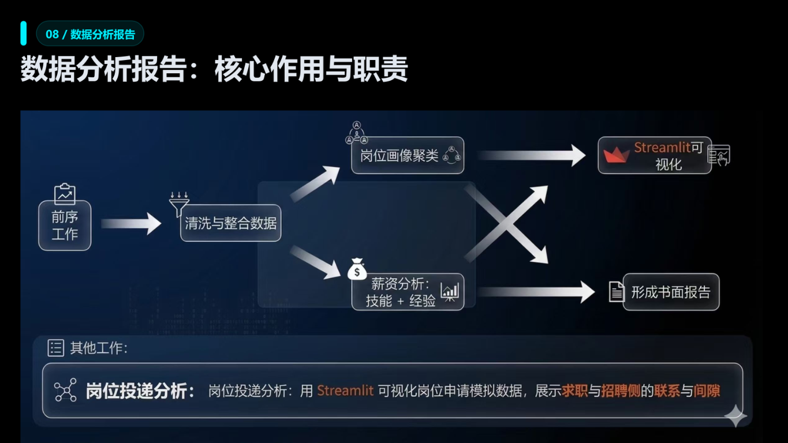
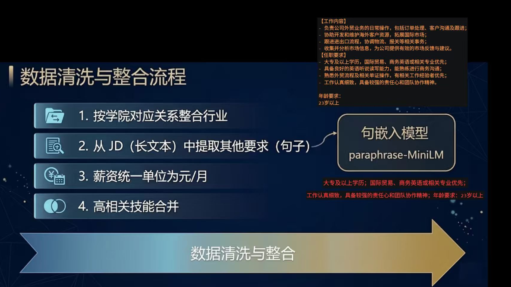
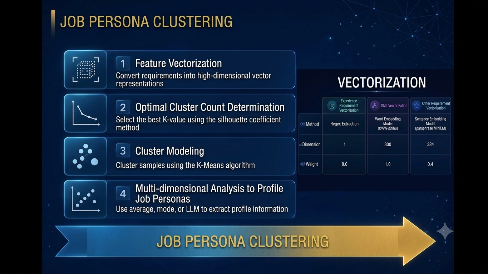
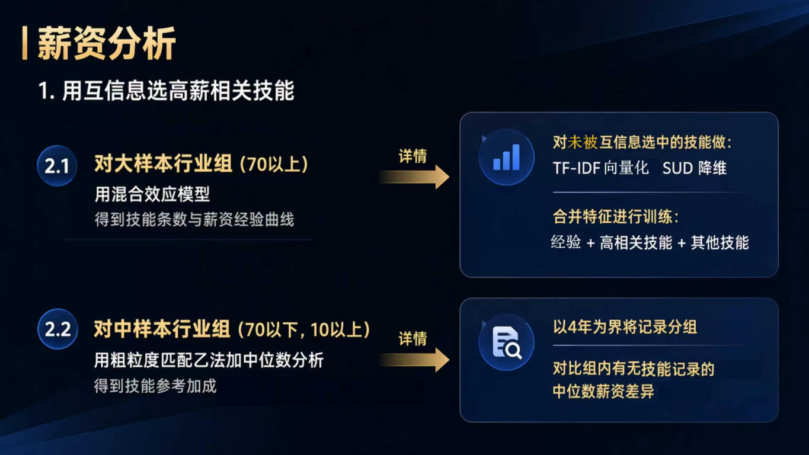
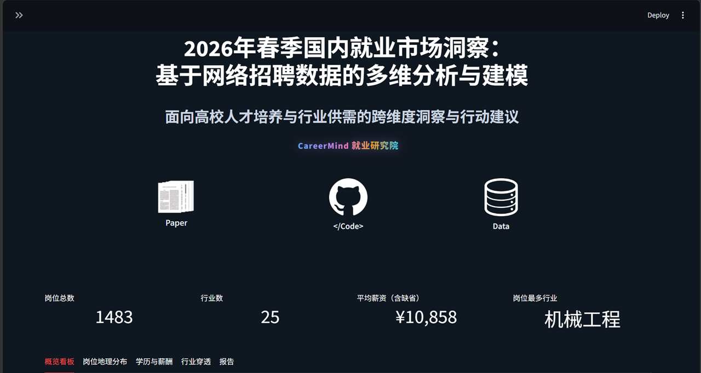
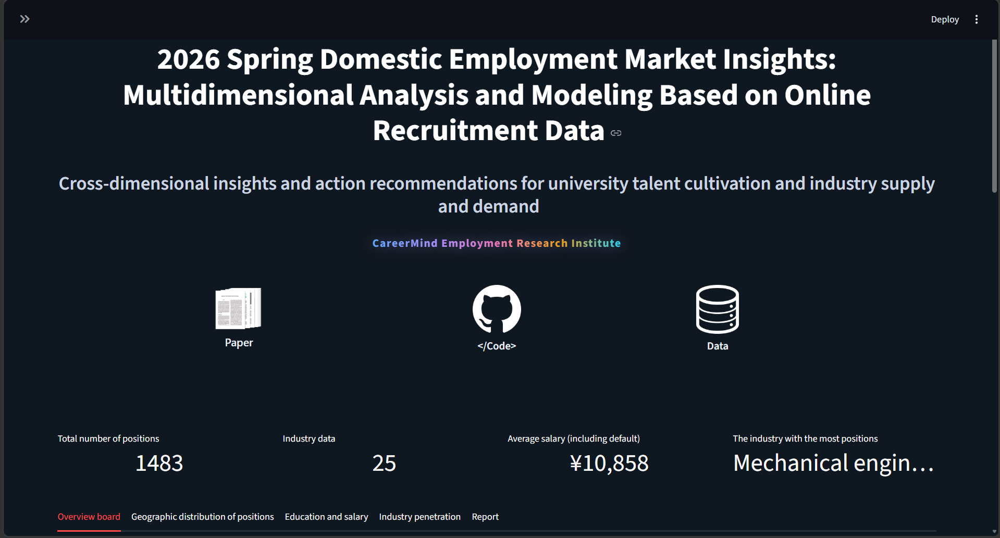

# CareerMind Data Analysis and Visualization

This repository has been reorganized to separate the core analysis package from the Streamlit dashboard.

- `analysis/` contains the original `ihatethinkingname/careermind-report` repository content, including analysis scripts and data artifacts.
- `career_mind_dashboard/` contains the Streamlit visualization application and the generated static report.

---

## 1. Overview

The workflow includes the following stages:

1. Data collection and preprocessing
2. Job description cleaning and integration
3. Feature engineering and vectorization
4. Job clustering and salary analysis
5. Interactive visualization with Streamlit and static report generation


The data analysis package is now located in `analysis/`, and the dashboard is located in `career_mind_dashboard/`.

This project uses cleaned job posting data to derive cluster profiles, salary curves, and skill importance.

Job data is cleaned, salary fields are normalized, experience is quantified, and high-correlation skills are merged for modeling.









---

## 2. Folder structure

### `analysis/`

This folder contains the relocated original remote repository structure:

- `analysis/code/` - core analysis scripts
  - `temp.py` - preprocess raw job postings and extract requirements
  - `etl.py` - transform and vectorize job data
  - `job_clustering.py` - perform industry clustering and profile generation
  - `salary_regression.py` - model salary by skills and experience
- `analysis/data/` - raw and processed data artifacts
  - `jobs().csv` - original job dataset
  - `jobs(1).csv` - cleaned data with extracted requirements
  - `job_vec.csv` - transformed job vectors
  - `skill_merge_preview.csv` - skill merging suggestions
  - `clustered_output/` - industry cluster profiles and results
  - `regression_output/` - salary curve and skill impact outputs
- `analysis/README.md` - original remote repository README

### `career_mind_dashboard/`

This folder contains the Streamlit application and static PDF report:

- `app.py` - Streamlit dashboard entry point
- `data_bridge.py` - dashboard data loader with fallback logic
- `requirements.txt` - Python dependencies for the dashboard
- `CareerMind_Report.pdf` - generated static report
- `data/` - optional dashboard data files for direct loading

---

## 3. How to start the Streamlit dashboard

Use a Python environment and install the required dependencies.

From the repository root:

```powershell
cd career_mind_dashboard
python -m pip install --upgrade pip
python -m pip install -r requirements.txt
streamlit run app.py --server.port 8501 --server.headless true
```

Then open the URL:

```text
http://localhost:8501
```

If port `8501` is already in use, choose another port:

```powershell
streamlit run app.py --server.port 8888 --server.headless true
```

The dashboard loads processed data from `career_mind_dashboard/data/` if present. If those files are missing, it can also fall back to processed outputs from `analysis/`, `analysis/clustered_output/`, and `analysis/regression_output/`.



Project was mainly built in Chinese; you may need to use browser translation.


---

## 4. Static report location

The generated PDF report is available in the dashboard folder:

- `career_mind_dashboard/CareerMind_Report.pdf`

The core analysis package also contains a copy of the report in:

- `analysis/CareerMind_Report.pdf`
